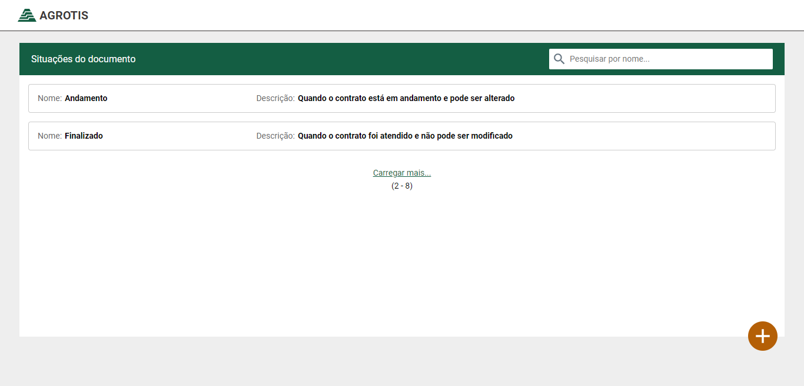
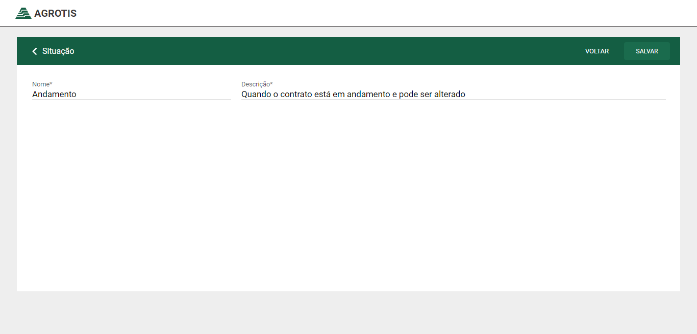

# Challenge accepted

React and Redux

-   [Challenge](https://github.com/agrotis-io/desafio-front) - Agrotis





## Steps to Setup

1. Install dependencies

```bash
> yarn
```

2. Run api

```bash
> json-server server.json -p 3333
```

3. Run app

```bash
> yarn start
```

Open <http://localhost:3000> to view it in the browser.
